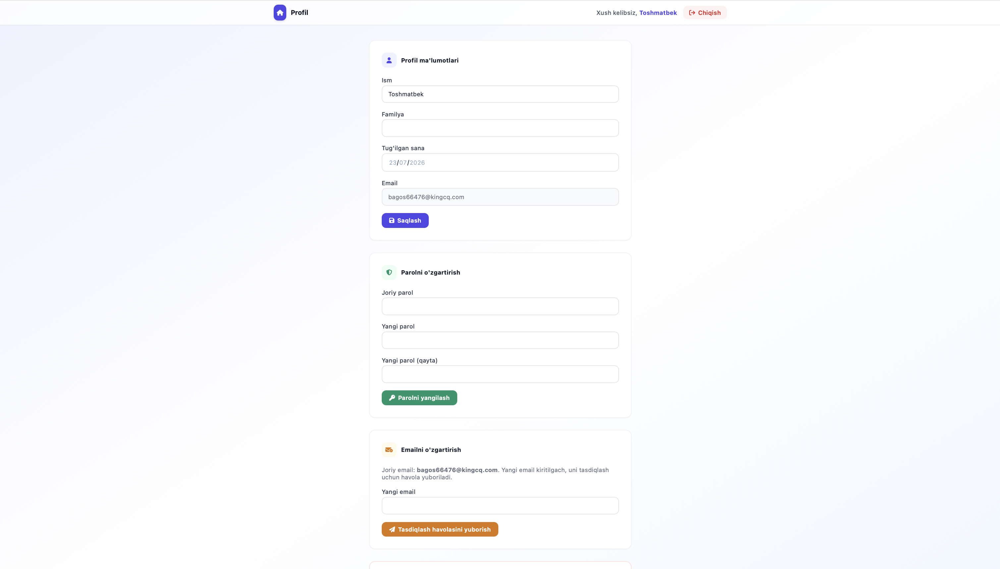
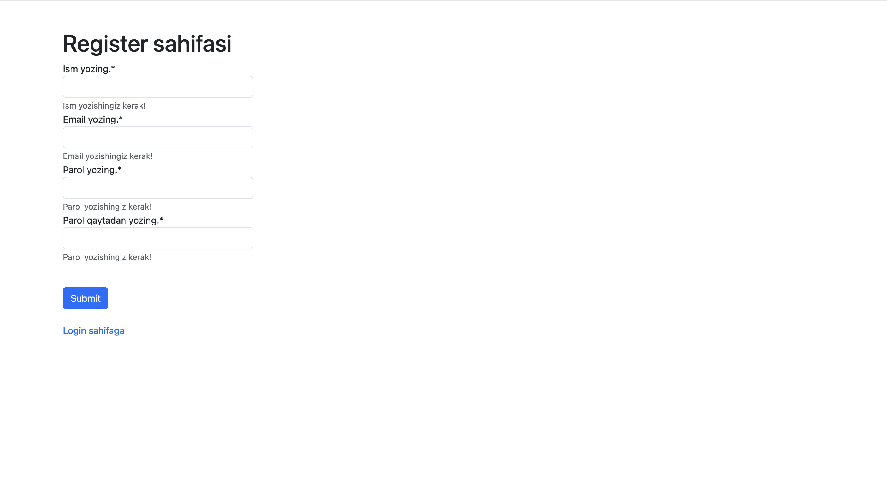
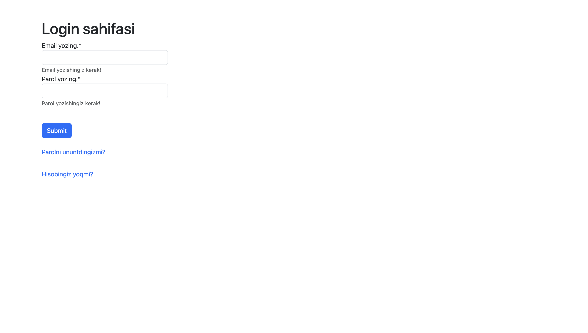
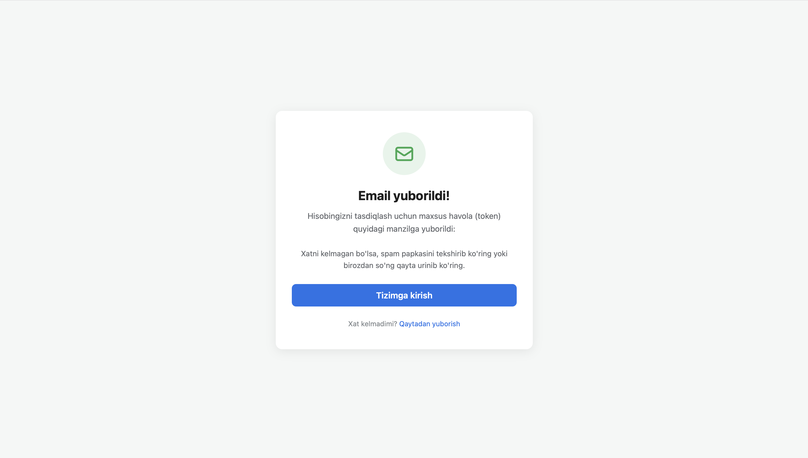
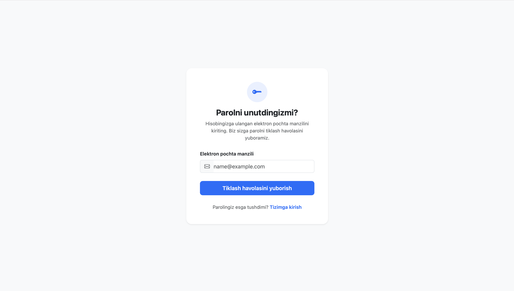

# SMTP Server — Django Email Auth

Django asosida qurilgan, email orqali tasdiqlash (verification) va parolni tiklash funksiyalariga ega autentifikatsiya tizimi. Foydalanuvchi ro'yxatdan o'tgach, SMTP orqali emailiga tasdiqlash kodi/havolasi yuboriladi.

**Loyiha demo:** https://rezxutewziyodev.pythonanywhere.com

## Texnologiyalar

- Python / Django 6.0.7
- django-environ — `.env` orqali sozlamalarni boshqarish
- django-crispy-forms + crispy-bootstrap4 — forma dizayni
- SQLite yoki PostgreSQL — `.env`dagi `DB_ENGINE` orqali tanlanadi
- SMTP (email yuborish)

## Loyiha strukturasi

```
smtp-server-django-email-auth/
├── config/                     # Django loyiha sozlamalari
│   ├── settings.py
│   ├── urls.py                 # asosiy URL router (admin/ + users/)
│   ├── asgi.py
│   └── wsgi.py
│
├── users/                      # asosiy ilova — auth va email tasdiqlash logikasi
│   ├── models.py                # CustomUser + VerificationsLink (5 daq) + ActionToken (email o'zgartirish/hisob o'chirish, 15 daq)
│   ├── forms.py
│   ├── views.py
│   ├── urls.py
│   ├── admin.py
│   └── migrations/
│
├── templates/                  # HTML shablonlar
│   ├── home.html
│   ├── profile.html             # profil tahrirlash, parol/email o'zgartirish, hisobni o'chirish
│   ├── login.html
│   ├── register.html
│   ├── verifi-token.html
│   ├── verifi-token-send.html
│   ├── verifi-token-confirm.html
│   ├── verifi-token-active.html
│   ├── verifi-resend.html
│   ├── forget-password/
│   │   ├── forget-password.html
│   │   ├── verifi-token-send.html
│   │   ├── mail-send.html
│   │   └── password-new.html
│   ├── change-email/            # yangi emailni tasdiqlash oqimi
│   │   ├── mail-send.html
│   │   ├── email-confirmed.html
│   │   ├── email-taken.html
│   │   └── link-expired.html
│   └── account-delete/          # hisobni o'chirishni tasdiqlash oqimi
│       ├── mail-send.html
│       ├── account-deleted.html
│       └── link-expired.html
│
├── images/                      # loyiha skrinshotlari (quyida)
├── manage.py
├── requirements.txt
├── .env / .env.example          # muhit o'zgaruvchilari
└── db.sqlite3
```

## URL marshrutlari

Havolalar jonli demo saytga (`https://rezxutewziyodev.pythonanywhere.com`) ishora qiladi.

| Yo'l | Tavsif |
|---|---|
| [`/`](https://rezxutewziyodev.pythonanywhere.com/) | Bosh sahifa |
| [`/login/`](https://rezxutewziyodev.pythonanywhere.com/login/) | Tizimga kirish |
| [`/logout/`](https://rezxutewziyodev.pythonanywhere.com/logout/) | Tizimdan chiqish |
| [`/register/`](https://rezxutewziyodev.pythonanywhere.com/register/) | Ro'yxatdan o'tish |
| [`/verify/`](https://rezxutewziyodev.pythonanywhere.com/verify/) | Email tasdiqlash |
| `/resend-mail/<token>/` | Tasdiqlash xatini qayta yuborish |
| [`/forget-password/`](https://rezxutewziyodev.pythonanywhere.com/forget-password/) | Parolni unutdingizmi |
| `/forget-password-verify/` | Parol tiklash kodini tasdiqlash |
| [`/forget-password-send/`](https://rezxutewziyodev.pythonanywhere.com/forget-password-send/) | Parol tiklash xatini yuborish |
| [`/profile/`](https://rezxutewziyodev.pythonanywhere.com/profile/) | Profil — ism/familya/tug'ilgan sana tahrirlash, parol/email o'zgartirish, hisobni o'chirish |
| `/confirm-email-change/` | Yangi emailni tasdiqlash havolasi (email orqali yuboriladi) |
| `/confirm-account-delete/` | Hisobni o'chirishni tasdiqlash havolasi (email orqali yuboriladi) |

## Ma'lumotlar modeli

- **User** — `AbstractUser`dan meros olgan, `username` o'rniga `email` orqali login qiladi (`CustomUserManager`), `birth_date` maydoni bilan.
- **VerificationsLink** — ro'yxatdan o'tish/parol tiklash uchun bir martalik `token` (UUID), yaratilgandan keyin **5 daqiqa** amal qiladi.
- **ActionToken** — email o'zgartirish va hisobni o'chirishni tasdiqlash uchun bir martalik `token` (`purpose`: `email_change` yoki `account_delete`, ixtiyoriy `new_email`), **15 daqiqa** amal qiladi.

## O'rnatish va ishga tushirish

```bash
python -m venv venv
source venv/bin/activate
pip install -r requirements.txt
```

`.env` faylini `.env.example` asosida to'ldiring:

```
SECRET_KEY=...
DEBUG=1
ALLOWED_HOSTS=127.0.0.1,localhost
CORS_ALLOWED_ORIGINS=http://localhost:3000,http://127.0.0.1:3000
CSRF_TRUSTED_ORIGINS=https://localhost:3000

EMAIL_HOST_USER=sizning-emailingiz@gmail.com
EMAIL_HOST_PASSWORD=gmail-app-parol
```

### SMTP provayderini o'zgartirish

`.env` faylidagi `EMAIL_HOST` / `EMAIL_PORT` / `EMAIL_USE_TLS` / `EMAIL_USE_SSL` orqali boshqariladi. Standart holatda Gmail ishlatiladi:

```
EMAIL_HOST=smtp.gmail.com
EMAIL_PORT=587
EMAIL_USE_TLS=1
EMAIL_USE_SSL=0
```

> **Eslatma (PythonAnywhere bepul tarif):** PythonAnywhere bepul hisoblarda faqat whitelist qilingan xizmatlarga tashqi ulanishga ruxsat beradi. Gmail SMTP uchun alohida firewall istisnosi bor, lekin Google IP-manzillarini tez-tez almashtirgani uchun ba'zida vaqtincha "Network is unreachable" xatosi berishi mumkin. Buni butunlay bartaraf etish uchun PythonAnywhere'ning doimiy whitelist qilingan provayderlaridan biriga (masalan **SendGrid**, **Mailgun**, **Mailjet**, **SMTP2GO**, **Zoho**) o'ting — shunchaki yuqoridagi `EMAIL_HOST`/`EMAIL_PORT`/`EMAIL_HOST_USER`/`EMAIL_HOST_PASSWORD`ni o'sha provayderning ma'lumotlariga almashtiring, kodga tegish shart emas.

### Baza tanlash: SQLite yoki PostgreSQL

`.env` faylidagi `DB_ENGINE` orqali boshqariladi.

**SQLite (standart, qo'shimcha sozlash shart emas):**

```
DB_ENGINE=sqlite3
```

**PostgreSQL:**

```
DB_ENGINE=postgresql
POSTGRES_DB=mydatabase
POSTGRES_USER=myuser
POSTGRES_PASSWORD=mypassword
POSTGRES_HOST=localhost
POSTGRES_PORT=5432
```

`DB_ENGINE=postgresql` bo'lganda `psycopg2-binary` paketi (`requirements.txt`da bor) PostgreSQL'ga ulanish uchun ishlatiladi.

Bazani tayyorlash va serverni ishga tushirish:

```bash
python manage.py migrate
python manage.py createsuperuser
python manage.py runserver
```

## Skrinshotlar

Loyihani jonli ko'rish: **https://rezxutewziyodev.pythonanywhere.com**

**Bosh sahifa**


**Profilni tahrirlash**



**Ro'yxatdan o'tish**



**Tizimga kirish**



**Tasdiqlash kodini yuborish**



**Parolni unutdingizmi**



